# Top 10 AI-Powered Data Scraping Tools You Need in 2025

---

Businesses and researchers today face a common challenge: how to efficiently extract accurate data from increasingly complex websites. Traditional web scraping methods struggle with dynamic content and anti-bot measures, often requiring constant manual updates. AI-powered data scraping tools have emerged as the solution, using machine learning and artificial intelligence to automatically adapt to website changes, handle JavaScript-rendered content, and deliver clean, structured data at scale. Whether you're monitoring competitor pricing, generating leads, or conducting market research, these intelligent tools can transform hours of manual work into minutes of automated extraction. This guide explores the 10 best AI-powered web scraping tools available in 2025, helping you find the perfect match for your data collection needs.

---

## 1. Browse AI

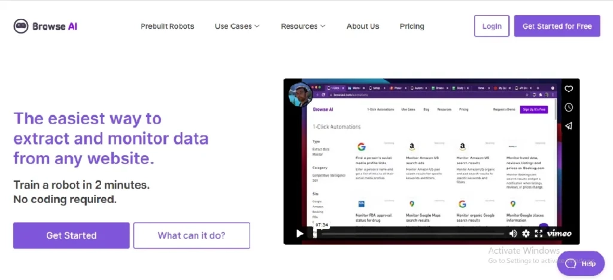

Browse AI brings a refreshing simplicity to web scraping. This cloud-based platform lets you train "bots" to extract specific data points by simply clicking on what you want—no coding gymnastics required. It's like teaching a smart assistant exactly what information matters to you.

What makes Browse AI particularly clever is its ability to watch websites for changes, perform sentiment analysis, and integrate with thousands of apps including Google Sheets, Notion, Airtable, and Slack. The tool handles pagination, scrolling, and even solves those annoying CAPTCHAs automatically. For teams without dedicated developers, this represents a genuine breakthrough in accessible data collection.

**Pricing**: Flexible monthly subscriptions starting at affordable rates for small teams.

**Key Innovations**: AI-driven automated data collection with zero technical expertise required.

**Browse AI Highlights**: Extracts data from any website globally with seamless integration across multiple platforms.

---

## 2. ScraperAPI

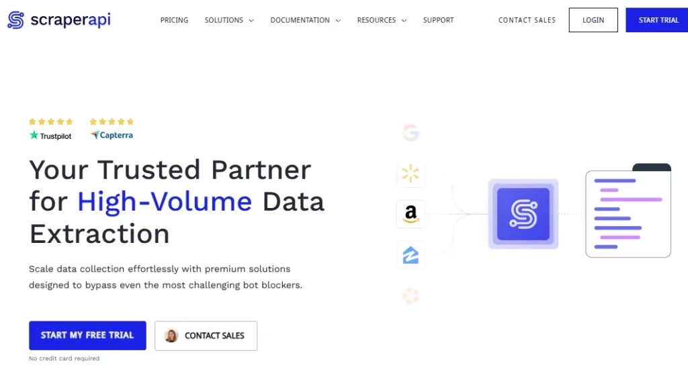

ScraperAPI takes a different approach—it's built for developers who want to get straight to the data without wrestling with proxies, browsers, or anti-bot systems. With a simple API call, you can retrieve HTML from virtually any webpage while ScraperAPI's infrastructure handles all the technical headaches.

The platform's AI-driven system intelligently rotates proxies, manages browser fingerprinting, and automatically retries failed requests. This makes it ideal for large-scale projects like price monitoring, lead generation, or market research where reliability matters more than flashy interfaces. 👉 [**Discover how ScraperAPI handles enterprise-level data extraction with 99.9% success rates**](https://www.scraperapi.com/?fp_ref=coupons) and unlimited bandwidth for serious scraping operations.

**Pricing**: Free plan available; paid plans start at $29/month for 250,000 requests.

**Key Innovations**: Smart retry system prevents errors; geolocation-based data collection enabled.

**ScraperAPI Highlights**: 99.9% success rate guaranteed with enterprise-grade infrastructure support.

---

## 3. Octoparse

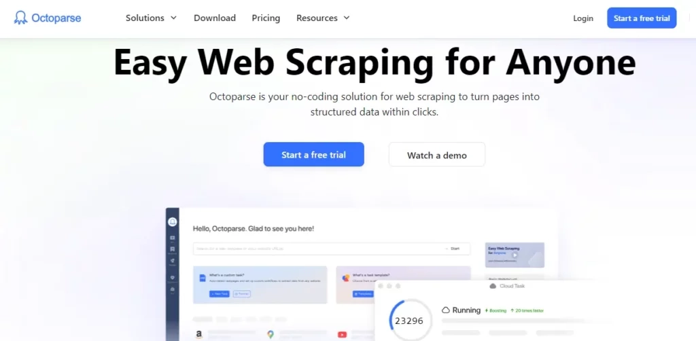

Octoparse strikes a nice balance between power and accessibility. Its point-and-click interface makes it approachable for beginners, while its AI Web Scraping Assistant adds sophisticated automation for more complex tasks. The cloud-based infrastructure handles heavy lifting, featuring IP rotation and task scheduling.

What's particularly useful is Octoparse's collection of pre-built templates for popular websites—think of them as ready-made recipes for common scraping scenarios. This means you can start extracting data from major platforms immediately, then customize as your needs evolve. The tool excels at creating web crawlers without requiring deep technical knowledge.

**Pricing**: Free tier available; Premium starts at $75/month for cloud automation.

**Key Innovations**: AI integration through web scraping assistant; pre-built templates for popular sites.

**Octoparse Highlights**: No coding knowledge required; automated data export with API support.

---

## 4. ScrapeStorm

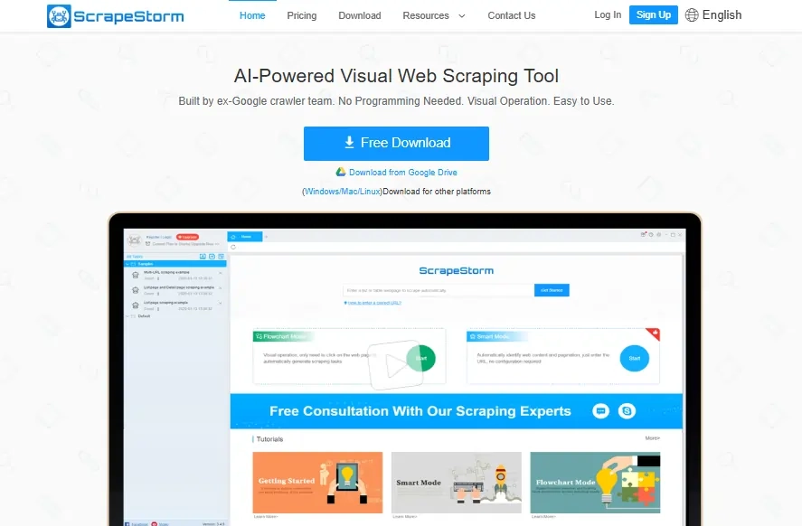

ScrapeStorm uses AI-powered structure analysis to automatically identify and extract data from websites—it essentially "reads" web pages the way humans do. This makes it particularly effective for tasks like lead generation, price monitoring, and market research where you need consistent data formats.

The platform's intuitive interface paired with powerful features like data cleaning, scheduling, and multiple export options simplifies the entire collection process. It's designed for users who want results without getting tangled in technical details, offering both cloud-based workflows and local extraction capabilities.

**Pricing**: Flexible plans ranging from free to enterprise-level subscriptions.

**Key Innovations**: AI-driven automatic element identification; cloud-based extraction workflow management.

**ScrapeStorm Highlights**: Zero-code scraping interface with real-time data collection capabilities.

---

## 5. Bardeen

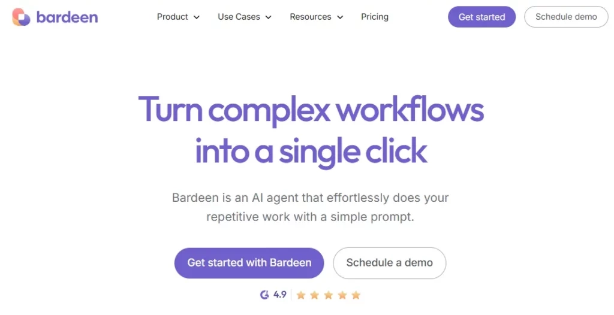

Bardeen thinks bigger than just scraping—it's an AI-powered automation platform that integrates web scraping into broader workflow systems. Using its "Magic Box" feature, you can create scraping automations with natural language commands, then connect them to your favorite business tools.

What sets Bardeen apart is its ability to learn and adapt to website changes over time, making it robust for dynamic web environments. The platform offers pre-built templates for common scenarios, letting you automate tasks across multiple platforms without starting from scratch each time. It's particularly valuable when data extraction is just one step in a larger business process.

**Pricing**: Free tier available; premium plans start at $10/month.

**Key Innovations**: Magic Box natural language commands; AI-driven intelligent task automation.

**Bardeen Highlights**: Instant productivity enhancement tool; transforms repetitive digital workflows.

---

## 6. WebHarvy

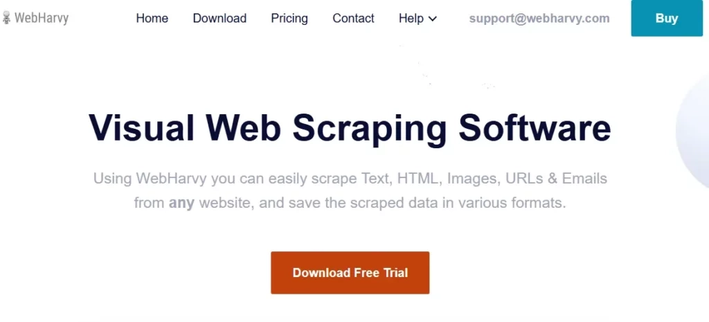

WebHarvy brings a visual approach to web scraping with smart pattern recognition and regular expression support. This desktop application uses intelligent detection to navigate complex websites and extract exactly the information you need—text, images, URLs, emails—without requiring programming knowledge.

The tool handles category scraping, JavaScript rendering, and image extraction comprehensively, making it versatile for various business needs from market research to lead generation. Its automatic pattern recognition engine learns from your selections, making subsequent scraping tasks faster and more accurate.

**Pricing**: Flexible plans starting with affordable one-time purchases.

**Key Innovations**: Point-and-click web data extraction; no-code intelligent scraping technology.

**WebHarvy Highlights**: Multi-format data export capabilities; automatic pattern recognition engine.

---

## 7. Diffbot

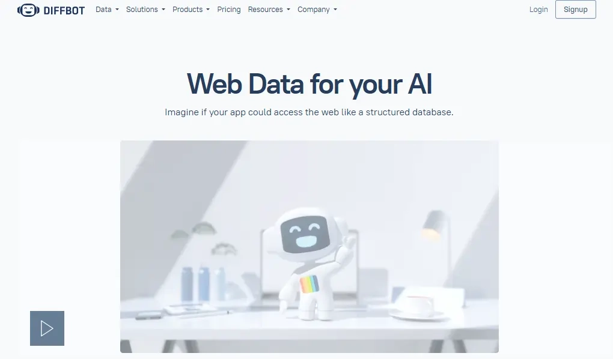

Diffbot represents the sophisticated end of AI scraping. This enterprise-grade platform uses advanced machine learning, computer vision, and natural language processing to precisely extract structured data from websites regardless of complexity. Think of it as having an army of intelligent readers who understand not just what's on a page, but what it means.

What makes Diffbot powerful is its knowledge graph integration and automatic content classification. It doesn't just grab data—it understands entities, relationships, and context. This makes it ideal for organizations requiring accurate data for large-scale projects like competitive analysis or company valuations.

**Pricing**: Free trial available; usage-based plans for enterprise needs.

**Key Innovations**: AI-powered data structuring with entity recognition and matching.

**Diffbot Highlights**: Scalable web data solutions with user-friendly API integration.

---

## 8. Import.io

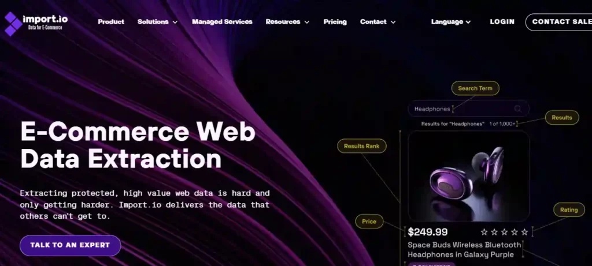

Import.io delivers enterprise-level web data extraction that scales. Its AI-driven algorithms handle complex scraping tasks at volume, ensuring high accuracy and efficiency even with challenging websites. The platform offers advanced scheduling, automatic website change detection, and integration with various data formats.

For organizations looking to extract deeper insights and integrate web data into business processes, Import.io provides the reliability needed for data-driven decision-making. It's designed for scenarios where data quality and consistency directly impact business outcomes, offering robust anti-blocking systems and coverage across 3,000+ websites simultaneously.

**Pricing**: Custom enterprise pricing based on data volume and frequency requirements.

**Key Innovations**: AI-powered data extraction technology; advanced anti-blocking security system.

**Import.io Highlights**: 60% faster data collection speed; covers 3,000+ websites concurrently.

---

## 9. ParseHub

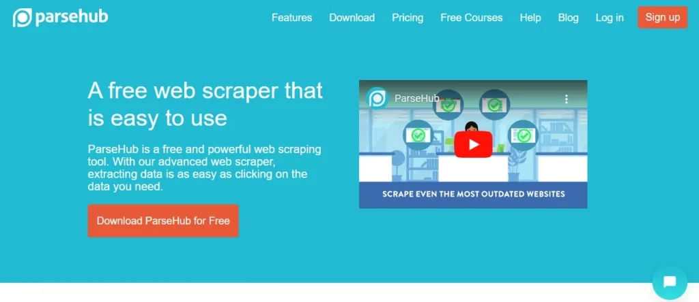

ParseHub excels at handling complex websites with dynamic content, multi-level navigation, and JavaScript-rendered pages. Its visual interface lets you create scraping projects by pointing and clicking, while its intelligent pattern recognition automatically identifies similar data structures across different pages.

The platform handles login requirements, session management, and data validation while providing robust scheduling and monitoring capabilities. Cloud-based processing with parallel execution means you can scrape multiple sources simultaneously without overwhelming your local resources. It's particularly effective for large-scale projects requiring consistent data from challenging sources.

**Pricing**: Free tier available; Premium from $149/month for advanced features.

**Key Innovations**: AI-driven pattern recognition technology; machine learning for dynamic content.

**ParseHub Highlights**: Handles complex web interactions automatically; downloads data in multiple formats.

---

## 10. Kadoa

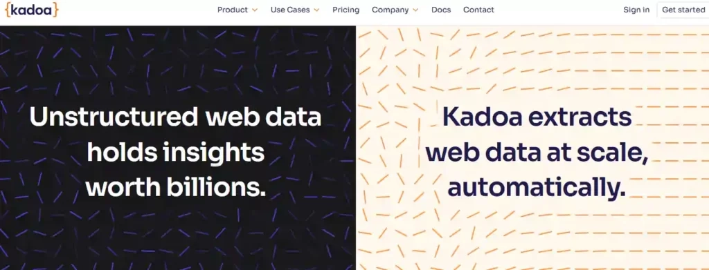

Rounding out our list, Kadoa brings intelligent automation to data extraction processes. Using advanced machine learning algorithms, Kadoa understands website structures and automatically generates optimal scraping patterns. Its ability to handle dynamic content and adapt to website changes without manual updates makes it a truly "set and forget" solution.

The platform's workflow automation capabilities extend beyond basic scraping, offering comprehensive data transformation and integration options. 👉 [**See why Kadoa's adaptive AI makes it perfect for businesses needing reliable, maintenance-free data collection**](https://www.scraperapi.com/?fp_ref=coupons) across multiple sources.

**Pricing**: Custom enterprise pricing with scalable solutions based on needs.

**Key Innovations**: AI-powered workflow automation; multi-format data extraction capabilities.

**Kadoa Highlights**: Enterprise-grade security protocols; seamless third-party integrations.

---

## How AI Transforms Web Data Collection

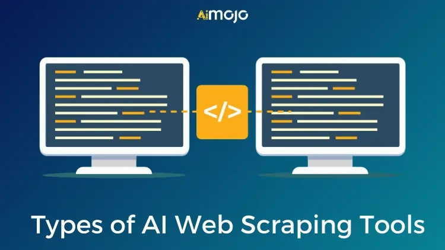

AI-powered web scrapers have fundamentally changed data collection by introducing unprecedented levels of automation, accuracy, and adaptability. These intelligent systems use machine learning algorithms to analyze complex patterns, handle dynamic content, and adapt to website structure changes without manual intervention.

The transformation is evident in their ability to process massive datasets through adaptive learning capabilities, enabling simultaneous extraction from multiple sources while maintaining high accuracy. Modern AI scrapers employ computer vision and natural language processing to understand visual layouts and contextual information, making them resilient to website updates and capable of extracting data from previously challenging sources.

The technology's self-adjusting mechanisms reduce maintenance requirements while increasing extraction speed. These systems excel at preprocessing data, automatically cleaning and normalizing information before storage, while their pattern recognition capabilities ensure consistent data quality across diverse sources.

Through intelligent error handling, these tools can identify and correct issues during the scraping process, significantly reducing manual oversight requirements. This technological advancement has democratized data collection, empowering both technical and non-technical users to harness the power of web scraping for market research, competitive analysis, and real-time decision-making.

---

## Smart Scraping: Your AI Data Collection Questions Answered

**How is AI web scraping different from traditional web scraping?**

AI web scraping uses machine learning and natural language processing for adaptability and accuracy, unlike rule-based traditional methods that require constant manual updates.

**What are the advantages of using AI-powered data scraping tools?**

AI scraping tools offer enhanced accuracy, adaptability to website changes, real-time analysis, time savings, and better data quality through intelligent preprocessing.

**What are some popular AI web scraping tools available?**

Popular tools include Octoparse, ScrapeStorm, Browse AI, WebHarvy, Diffbot, Import.io, ParseHub, ScraperAPI, and Kadoa.

**What key features should I consider when choosing an AI web scraping tool?**

Consider ease of use, data output formats, cost and scalability, ethical compliance capabilities, and available support and community resources.

**Can AI web scraping tools handle dynamic websites and JavaScript content?**

Yes, AI-powered tools effectively handle dynamic content and JavaScript rendering, adapting to website changes and extracting data efficiently without manual configuration.

**What are the different types of AI web scraping tools?**

Types include rule-based, machine learning-based, NLP-based, visual, and API-based scrapers, each suited to different tasks and technical requirements.

**How do I ensure ethical and legal compliance when using AI web scraping tools?**

Respect website terms of service, robots.txt rules, and data protection regulations like GDPR and CCPA. Always consider the ethical implications of your data collection.

**Are there free AI web scraping tools available?**

Yes, several tools offer free plans with basic features, including Octoparse, ScrapeStorm, ParseHub, and ScraperAPI's trial tier.

**What are common use case scenarios for AI web scraping?**

Use cases include market research, lead generation, price monitoring, competitor analysis, content aggregation, and sentiment tracking across industries.

---

The emergence of AI-powered web scraping tools has transformed how businesses collect data. These tools offer unparalleled accuracy, efficiency, and adaptability, enabling organizations to extract valuable insights from websites regardless of complexity.

By automating the data collection process, businesses can free up resources for critical tasks, gain competitive advantages, and make data-driven decisions with confidence. Explore the tools discussed in this guide and choose the one that best fits your business needs to unlock the true potential of web data and achieve successful scraping outcomes.
